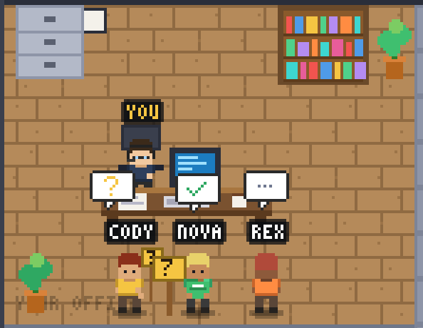
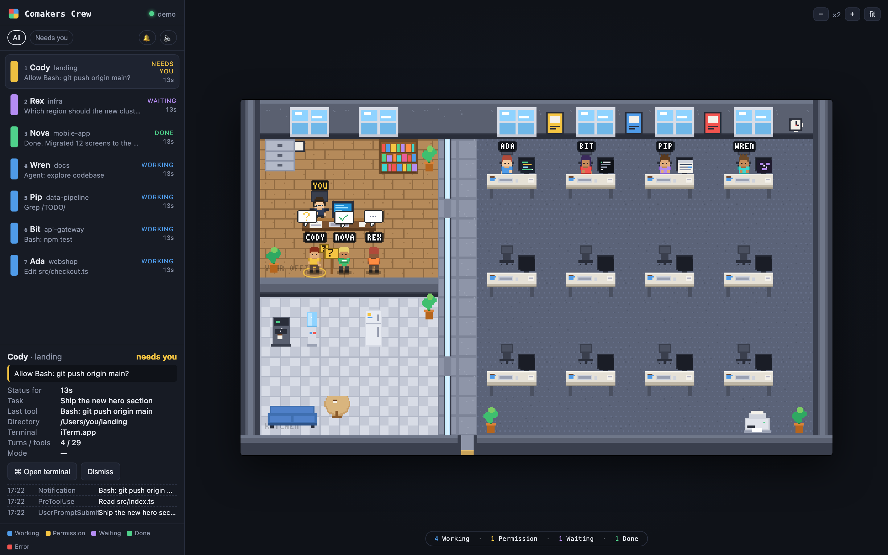

<p align="center">
  
</p>

<h1 align="center">Comakers Crew</h1>

<p align="center">
  <b>A live pixel-art office for your Claude Code sessions.</b><br>
  Every running <code>claude</code> becomes a colleague. They work at their desks, and walk over to yours when they need you.
</p>

<p align="center">
  <a href="#quick-start"></a>
  
  
  
  
  <a href="LICENSE"></a>
</p>

---

## Why

If you run several Claude Code sessions at once, you end up cycling through terminal tabs to find out
which one is stuck on a permission prompt, which one finished, and which one is still grinding.

Comakers Crew turns that into a glance. It is a small browser window with a 32×32 pixel-art office:

- **You** sit in a glass-walled office on the left.
- **Each session** gets a workstation in the open space. The monitor shows what it is doing right now.
- When a session **needs you**, its character walks into your office and stands in front of your desk.
- Click a character and press **Enter**. The terminal tab that owns that session comes to the front.

No screen recording, no cloud, no accounts. Everything runs locally from Claude Code hooks.

<p align="center">
  
</p>

## What the crew does

| Session state | In the office |
| --- | --- |
| **Working** | Types at a workstation. The monitor shows the activity: code editor (Edit/Write), terminal (Bash), document (Read/Grep/Web), agent graph (Agent), spinner (thinking) |
| **Permission** | Runs into your office and holds up a yellow **?** sign |
| **Waiting** | Comes to your desk and waves. After two minutes, wanders off to the kitchen for coffee |
| **Completed** | Brings a green folder with a ✓ to your desk |
| **Error** | Red **!**, arms up, monitor turns red, then back to work |

The side panel lists every session sorted by urgency, with the task, last tool, message and an event log.
Press `1`–`9` to select a colleague, `Enter` to open their terminal, `Esc` to deselect.

<p align="center">
  
</p>

## When you are in another tab

- The **tab title** carries a counter and the most urgent item, e.g. `(2) ❓ Cody · Allow Bash: git push?`.
  While a session waits for permission and the tab is in the background, the title blinks.
- The **favicon** gets a coloured badge with the count (yellow = permission, red = error,
  purple = waiting, green = done), so pinned tabs work too.
- 🔔 enables **macOS notifications** (click one to jump straight to that terminal).
  🔈 adds a short beep on permission requests and errors. Both are off by default.

## Quick start

Requirements: **macOS** (terminal focusing uses AppleScript; the office itself renders anywhere),
**Node.js 20+**, **Claude Code 2.1+** (hooks support).

```bash
git clone https://github.com/rontoday/comakers-crew.git
cd comakers-crew
npm install
npm run hooks:install   # adds hooks to ~/.claude/settings.json (a backup is written first)
npm start               # builds the client, starts the server, opens http://127.0.0.1:4242
```

Then start `claude` in any terminal. Sessions that were already running need a restart to pick up the hooks.

No sessions yet? Press **Run demo crew** in the panel, or open `http://127.0.0.1:4242/?demo=1`.

### Prefer not to use the terminal?

After `npm install` and `npm run hooks:install`, you can drive everything from Finder:

| File | What it does |
| --- | --- |
| `Comakers Crew.command` | Starts the server in the background and opens the browser |
| `Comakers Crew — Stop.command` | Stops the server |
| `Comakers Crew — Autostart.command` | Toggles starting Comakers Crew at login (macOS LaunchAgent) |

### Uninstall

```bash
npm run hooks:uninstall   # removes the hooks from ~/.claude/settings.json
```

## How it works

```
claude ──hook──▶ hook/comakers-hook.sh ──POST /hook──▶ server (Node, :4242) ──SSE──▶ browser (PixiJS)
                                                            │
                                                 POST /api/sessions/:id/focus ──▶ osascript (iTerm2 / Terminal.app / tmux)
```

- **`hook/comakers-hook.sh`** is registered for `SessionStart`, `UserPromptSubmit`, `PreToolUse`,
  `PostToolUse`, `PostToolUseFailure`, `PermissionRequest`, `Notification`, `Stop`,
  `SubagentStart/Stop`, `PreCompact` and `SessionEnd`. It forwards the hook JSON plus the terminal
  identity (tty, `TERM_PROGRAM`, tmux pane, pid) with a 2 s timeout and **always exits 0**, so it
  can never block or slow down Claude. It costs about 60 ms per event.
- **`server/state.ts`** turns hook events into a session state machine
  (`idle → working → permission | waiting | completed | error`).
- **`server/focus.ts`** brings the right terminal tab to the front: iTerm2 and Terminal.app by tty,
  tmux by pane, everything else by app bundle id.
- **`client/`** renders the office with PixiJS. Every sprite (characters, furniture, tiles, speech
  bubbles, the 3×5 pixel font) is generated procedurally at startup in `client/src/game/sprites.ts`.
  There are no image assets. Characters are 32×32 with 2–4 frame animations, drawn at an integer
  zoom (×2…×6) so pixels stay crisp.

Everything stays on your machine. The server binds to `127.0.0.1` only.

## Scripts

| Command | What it does |
| --- | --- |
| `npm start` | Build the client and run the server (opens the browser) |
| `npm run dev` | Server with reload + Vite dev server on `http://localhost:5173` |
| `npm run hooks:install` | Add the hooks to `~/.claude/settings.json` (idempotent) |
| `npm run hooks:uninstall` | Remove them again |
| `npm run typecheck` | Type-check client and server |

Environment: `COMAKERS_PORT` (default `4242`) is honoured by the server and the hook script;
`COMAKERS_DEBUG=1` logs every hook event on the server.

## Project layout

```
hook/      comakers-hook.sh, install.mjs
server/    index.ts (HTTP + SSE), state.ts (session state machine), focus.ts (terminal focusing)
shared/    types.ts
client/    Vite + PixiJS app
  src/game/pixel.ts    pixel canvas helper, 3×5 font
  src/game/sprites.ts  procedural characters, props
  src/game/office.ts   floor/wall tiles and office furniture, monitor screens
  src/game/world.ts    office layout, workstations, visitor slots, routing
  src/game/agent.ts    crew member behaviour (movement, animation per status)
  src/game/scene.ts    PixiJS scene
  src/ui/panel.ts      side panel, details, summary bar
  src/ui/attention.ts  tab title, favicon badge, notifications, sound
```

## FAQ

**Does it slow Claude down?** No. The hook is a tiny bash script that POSTs to localhost with a
2 s timeout and exits 0 regardless of the outcome. If the server is not running, nothing happens.

**Does it send anything anywhere?** No. The server listens on `127.0.0.1` only, and there is no
telemetry.

**Linux / Windows?** The office and the panel work in any browser. Terminal focusing is macOS-only
for now (AppleScript). PRs welcome.

**Can I change the hooks it installs?** Yes. `hook/install.mjs` is ~60 lines. It preserves your
existing hooks and writes a timestamped backup of `settings.json` before touching it.

## License

[MIT](LICENSE)
