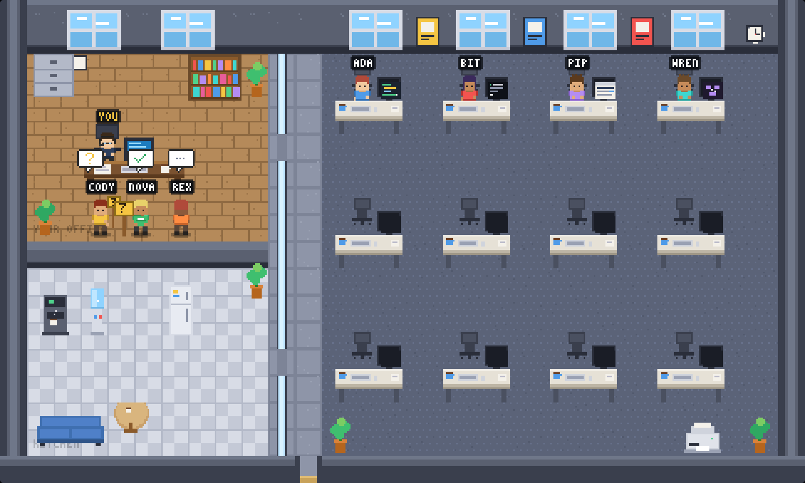

<p align="center">
  
</p>

<h1 align="center">Kancl</h1>

<p align="center">
  <b>Osobní velín nad Claude Code sezeními a projekty.</b><br>
  Každé běžící <code>claude</code> je kolega u stolu. Každý projekt z <code>~/Code</code> má svůj ostrůvek stolů.
  Když někdo něco potřebuje, přijde k tobě.
</p>

---

## Co to je

Když běží víc Claude Code sezení naráz, přepínáš mezi taby a hledáš, které z nich stojí na potvrzení příkazu.
Kancl to ukáže v jednom okně prohlížeče jako 32×32 pixel‑artovou kancelář:

- **Ty** sedíš v prosklené kanceláři vlevo.
- **Každý projekt** (složka v `~/Code`, sloučená podle git remotu) má ostrůvek stolů s cedulkou.
  Projekt, ve kterém běží sezení, svítí. Projekt s dotazem zežloutne. Klidné projekty jsou zhasnuté vzadu.
- **Každé sezení** sedí u stolu svého projektu. Monitor ukazuje, co dělá (editor, terminál, dokument, agenti, přemýšlení).
- **Subagenti** jsou malé postavičky vedle rodiče.
- Když sezení **potřebuje tebe**, postavička přijde do tvé kanceláře. Klik na ni a **Enter** vytáhne dopředu její terminál.

Levý panel je strom projektů: větev, počet změn, otevřené PR (GitHub) a MR (GitLab), pod tím sezení.
Klik na projekt otevře detail s worktree, commity a odkazy na PR/MR.

Žádný cloud, žádné účty, žádná telemetrie. Server poslouchá jen na `127.0.0.1`.

## Stavy sezení

| Stav | V kanceláři |
| --- | --- |
| **práce** | Píše u stolu. Monitor: editor (Edit/Write), terminál (Bash), dokument (Read/Grep/Web), graf agentů (Agent), spinner (přemýšlí) |
| **dotaz** | Přiběhne do tvé kanceláře a drží žlutou ceduli **?** |
| **čeká** | Přijde ke stolu a mává. Po dvou minutách odejde do kuchyňky na kafe |
| **hotovo** | Přinese zelenou složku s ✓ |
| **chyba** | Červený **!**, ruce nahoře, monitor zčervená, pak zpátky k práci |

Klávesy: `1`–`9` vybere sezení v pořadí panelu, `Enter` otevře jeho terminál, `Esc` zruší výběr.
Když jsi v jiném tabu, titulek a favicon nesou počítadlo; 🔔 zapne macOS notifikace, 🔈 pípnutí při dotazu a chybě.

## Rychlý start

Požadavky: **macOS** (přepínání terminálu jde přes AppleScript; kancelář sama běží kdekoli), **Node.js 20+**, **Claude Code 2.1+**.

```bash
git clone https://github.com/davidskoupy/kancl.git ~/Code/kancl
cd ~/Code/kancl
npm install
npm run hooks:install   # zapíše hooky do ~/.claude/settings.json (předtím udělá zálohu)
npm start               # sestaví klienta, spustí server, otevře http://127.0.0.1:4242
```

Pak spusť `claude` v libovolném terminálu. Už běžící sezení je potřeba restartovat, aby si načetla hooky.

Bez sezení stiskni v panelu **Pustit ukázkovou partu**, nebo otevři `http://127.0.0.1:4242/?demo=1`.

Cesta k hook skriptu je v `settings.json` absolutní. Když repo přesuneš, spusť `npm run hooks:install` znovu.

### Bez terminálu

| Soubor | Co dělá |
| --- | --- |
| `Kancl.command` | Spustí server na pozadí a otevře prohlížeč |
| `Kancl — Stop.command` | Zastaví server |
| `Kancl — Autostart.command` | Zapne/vypne start po přihlášení (macOS LaunchAgent) |

### Odinstalace

```bash
npm run hooks:uninstall
```

## Projekty, GitHub, GitLab

Kancl při startu projde `~/Code` (a další kořeny z configu), sloučí složky se stejným git remotem do jednoho projektu
(worktree) a každých 15 s čte lokální stav gitu: větev, počet změn, ahead/behind, poslední commit.
**Nikdy nedělá `git fetch`.**

- **GitHub PR** bere přes přihlášené `gh` (`gh auth login`).
- **GitLab MR** potřebují personal access token s právem `read_api`. Ulož ho do `.env` v kořeni repa Kanclu:

  ```
  GITLAB_TOKEN=glpat-...
  ```

  nebo do proměnné prostředí `GITLAB_TOKEN`. Bez tokenu se u GitLab projektů zobrazí jen lokální stav gitu a poznámka.

PR/MR se obnovují každých 5 minut a 10 s po skončení tahu sezení v daném projektu.

## Noční směna

Dole v kanceláři je serverovna. Každý robot je jedna **naplánovaná úloha Claude** (ty ze `~/.claude/scheduled-tasks`,
rozvrh čte Kancl ze `scheduled-tasks.json` aplikace Claude). Robot spí do času běhu, po běhu drží ✓ nebo !.
Pod robotem jsou hodiny s rozvrhem. V panelu je sekce **Noční směna**: rozvrh česky, poslední běh, výsledek.

Výsledek běhu bere Kancl z logů obsahových enginů:

- **content engine** (`~/Code/content-engine/runs.md` + `state.json`): který web byl na řadě, jestli běh prošel,
  kdo je zítra na řadě, a **zásoba témat** (žlutě, když některý web klesne na 5 a méně).
- **Dopner** (`~/Code/Dopner/content-runs.md`): stav týdenního článku.

Kancl úlohy **nespouští ani nevypíná**, jen čte. Klik na robota otevře detail, tlačítko `Otevřít SKILL.md` otevře
zadání úlohy ve výchozím editoru. cron-job.org zatím napojený není (datový model s ním počítá, chybí API klíč).

### Cloud přes most

Cloudové routiny (claude.ai/code/routines) a cloudová sezení nejsou na disku a jdou číst jen s přihlašovacím
tokenem. Kancl token nedrží. Místo toho naplánovaná lokální úloha **`kancl-cloud-snapshot`** (každou hodinu v :27)
vypíše routiny a sezení nástroji, které má sezení Claude, a zapíše ořezaný snímek do `~/.kancl/cloud.json`:
názvy, rozvrhy, stav posledního běhu, odkazy. Žádné prompty, žádný obsah sezení.

- Routiny jsou v serverovně **bílí roboti** (lokální úlohy barevní), v panelu mají štítek `cloud`
  a v detailu odkaz „Otevřít na claude.ai". Cron routin je v UTC, Kancl ho ukazuje v místním čase.
- Cloudová sezení jsou v panelu v sekci **V cloudu** (bez postaviček).
- V hlavičce noční směny je stáří snímku. Starší než 2 h svítí oranžově: aplikace Claude asi neběžela,
  protože lokální úlohy běží jen s otevřenou aplikací.
- Cestu snímku mění `night.cloudSnapshot` v configu.

## Sezení z desktopové aplikace

Kancl čte názvy sezení z aplikace Claude (`local_*.json` v Application Support) a páruje je s hooky, takže v panelu
vidíš „Fragmento HTML šablona", ne jen přezdívku. **Enter** (nebo „Otevřít v aplikaci Claude") otevře sezení přes
`claude://code/continue?session=…`. **Tab** přeskakuje na nejdéle čekající sezení, Shift+Tab zpět, **/** skočí do hledání.

- `?mini=1` — pruh do rohu obrazovky: souhrn, fronta „chce mě", stav noční směny. Bez pixelové scény.
  Otevři ho v samostatném okně (Chrome → Vytvořit zástupce / otevřít jako aplikaci) a nech nahoře.
- `?digest=1` — ranní přehled: co se stalo od včerejška (skončená sezení, noční směna, CI selhání, zásoba témat,
  kdo teď čeká). Data jsou i na `GET /api/digest?since=<ms>` (pro skill `/morning`).

## Zdraví projektu

- **GitHub Actions**: u GitHub projektů poslední 3 běhy (`gh run list`), v panelu `CI ✗` / `CI …`, v detailu odkazy.
  Kancl žádné workflow nezakládá, jen čte.
- **Stárnutí**: „nejstarší 9 d" u necommitnutých změn; worktree, jehož větev je sloučená a 14 dní se nehnul,
  dostane štítek `zastaralé` a tlačítko, které zkopíruje `git worktree remove …` do schránky. Kancl nic nemaže.
- **Notifikace noční směny**: selhání úlohy, starý snímek cloudu, nový alarm zásoby témat (stejné 🔔 / 🔈 jako u sezení).
- **Historie**: `~/.kancl/history.jsonl`, 7 dní (skončená sezení, úlohy ok/chyba, CI selhání, alarmy). `GET /api/history?since=<ms>`.

## Skupiny, hledání, připnutí

Projekty se v panelu řadí do skupin z configu (`groups`, glob na id nebo název; výchozí Shean / Klienti / Vlastní weby,
zbytek „ostatní"). Špendlík u projektu ho drží nahoře i v klidu. Hledání filtruje projekty, sezení, úlohy i cloud.
Rozbalení, filtr, zoom a připnutí přežijí reload.

## Kancl v mobilu (Tailscale)

Kancl poslouchá jen na `127.0.0.1`. Když ho chceš v telefonu, pusť server na adrese tailnetu (nikdy `0.0.0.0`):

```bash
KANCL_HOST=100.x.y.z npx tsx server/index.ts
```

a v telefonu otevři `http://100.x.y.z:4242/?mini=1`. Hook skript posílá dál na `127.0.0.1`, takže ho to neovlivní.

## Config

`~/.config/kancl/config.json` vznikne při prvním startu:

```json
{
  "roots": ["~/Code"],
  "hidden": [],
  "gitIntervalSec": 15,
  "remoteIntervalMin": 5,
  "gitlabHosts": ["gitlab.shean.dev"],
  "night": {
    "enabled": true,
    "engines": [
      { "id": "content-engine", "runsFile": "~/Code/content-engine/runs.md", "stateFile": "~/Code/content-engine/state.json", "taskId": "daily-content" },
      { "id": "dopner", "runsFile": "~/Code/Dopner/content-runs.md", "taskId": "dopner-tydenni-clanek", "columns": { "slug": 1, "result": 2, "note": 4 } }
    ]
  }
}
```

- `roots` — složky, ve kterých se hledají projekty (jen první úroveň).
- `hidden` — id projektů (`github.com/user/repo`) nebo názvy složek, které se nemají ukazovat.
- `gitlabHosts` — hostitelé, které se mají brát jako GitLab (kromě těch, co mají „gitlab" v názvu).
- `groups` — skupiny projektů: `[{ "name": "Shean", "match": ["gitlab.shean.dev/*"] }, …]`.
- `night.enabled` — vypne noční směnu.
- `night.engines` — logy enginů: `runsFile`, volitelně `stateFile`, `taskId` (id naplánované úlohy, ke které výsledek patří)
  a `columns` (indexy sloupců tabulky, výchozí `| datum | web | téma | výsledek | poznámka |`).

Změna configu vyžaduje restart serveru.

## Jak to funguje

```
claude ──hook──▶ hook/kancl-hook.sh ──POST /hook──▶ server (Node, :4242) ──SSE──▶ prohlížeč (PixiJS)
                                                        │      ▲
                                                        │      └── skener: readdir ~/Code, git, gh, GitLab REST
                                                        └── POST /api/sessions/:id/focus ──▶ osascript (iTerm2 / Terminal.app / tmux)
```

- **`hook/kancl-hook.sh`** je registrovaný na `SessionStart`, `UserPromptSubmit`, `PreToolUse`, `PostToolUse`,
  `PostToolUseFailure`, `PermissionRequest`, `Notification`, `Stop`, `SubagentStart/Stop`, `PreCompact` a `SessionEnd`.
  Pošle JSON hooku plus identitu terminálu s timeoutem 2 s a **vždy skončí s 0**, takže Claude nikdy nezablokuje.
- **`server/state.ts`** převádí hooky na stavový automat sezení, **`server/scanner.ts`** skenuje projekty,
  **`server/projects.ts`** je čistá logika (normalizace remotů, slučování, stav, řazení).
- **`shared/plan.ts`** rozděluje 12 stolů mezi projekty: aktivní dostanou počet sezení + 1 (nejvýš 4), klidné po jednom.
- **`server/night.ts`** je čistá logika noční směny (cron, český rozvrh, parser runs.md, zásoba, stav), **`server/nightScanner.ts`** ji krmí ze souborů.
- **`client/`** vykresluje kancelář v PixiJS. Všechny sprity se generují v kódu, žádné obrázky.

## Skripty

| Příkaz | Co dělá |
| --- | --- |
| `npm start` | Sestaví klienta a spustí server (otevře prohlížeč) |
| `npm run dev` | Server s reloadem + Vite dev server na `http://localhost:5173` |
| `npm test` | Unit testy (`node --test`) |
| `npm run typecheck` | Typová kontrola klienta i serveru |
| `npm run hooks:install` / `hooks:uninstall` | Zapsat / odebrat hooky v `~/.claude/settings.json` |

Prostředí: `KANCL_PORT` (výchozí `4242`) respektuje server i hook; `KANCL_DEBUG=1` loguje každou událost;
`KANCL_CONFIG` přesměruje config.

## Rozvržení repa

```
hook/      kancl-hook.sh, install.mjs
server/    index.ts (HTTP + SSE), state.ts (sezení), scanner.ts (projekty, I/O), projects.ts (čistá logika),
           night.ts (noční směna, čistá logika), nightScanner.ts (I/O), config.ts, focus.ts
shared/    types.ts, plan.ts (ostrůvky), names.ts (přezdívky)
client/    Vite + PixiJS
  src/game/  pixel.ts, sprites.ts, office.ts, world.ts, agent.ts, scene.ts
  src/ui/    panel.ts (strom projektů), attention.ts (titulek, favicon, notifikace)
tests/     node --test
docs/      superpowers/specs, superpowers/plans
```

## Původ a licence

Kancl je fork projektu [Comakers Crew](https://github.com/rontoday/comakers-crew) od rontoday (MIT).
Přidává vrstvu projektů z gitu, GitHub/GitLab, subagenty, české UI a nový název. Licence zůstává [MIT](LICENSE).
